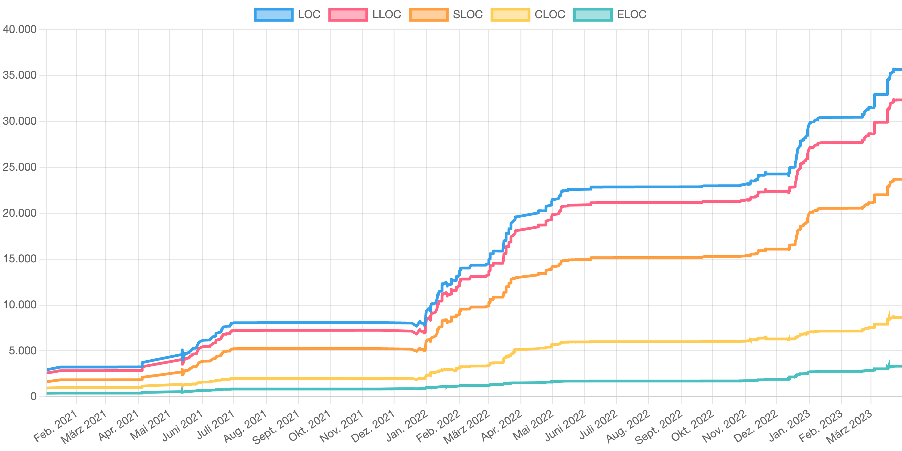

# GitLocHistory

GitLocHistory is a command line tool that calculates and visualizes the history of total lines (LOC), code lines (SLOC), comment lines (CLOC), logical lines (LLOC) and empty lines (ELOC) of Git repositories. In addition to individual ones, multiple Git repositories and repositories with submodules can also be processed simultaneously, with the statistics summed together.

GitLocHistory uses `scc` (https://github.com/boyter/scc), a gold standard for calculating lines of code.




## Terminology

There are different understandings of which abbreviation means what. In this project the abbreviations are used as follows:

- **LOC**: Total lines of code (SLOC + CLOC + ELOC)
- **LLOC**: Lines of logical code (SLOC + CLOC)
- **SLOC**: Lines of source code
- **CLOC**: Lines of comments
- **ELOC**: Blank (empty) lines


## Prerequisites

Before you can use GitLocHistory, you need to have the following tools installed on your system:

- Python 3.7 or later (https://www.python.org/downloads/)
- `git` (https://git-scm.com/downloads)
- `scc` (https://github.com/boyter/scc#installation)


## Installation & Usage

1. [Download the latest release](https://github.com/lennartmoeller/GitLocHistory/releases/latest/download/glh.zip) and extract the zip file.

2. Open a terminal and navigate to the extracted directory.

3. Install the required Python packages:
   ```shell
   pip3 install -r requirements.txt
   ```

4. Modify the file named `config.json`. See the Configuration section for more details.

5. Run GitLocHistory:
   ```shell
   python3 glh.py
   ```

6. Open the `viewer.html` file in your browser to view the result diagram.

7. The output is saved in the output JSON file.


## Configuration

GitLocHistory uses a configuration file named `config.json`.

Here's an example `config.json` file:

```json
{
  "output": "locs.json",
  "repos": [
    {
      "url": "https://github.com/example/repo1.git",
      "dir": "directory/to/analyse",
      "include_submodules": false,
      "scc": {
        "exclude-dir": ["docs"],
        "include-ext": ["java", "php"]
      }
    },
    {
      "url": "https://github.com/example/repo2.git",
      "scc": {
        "exclude-ext": ["json"]
      }
    }
  ],
  "scc": {
    "exclude-dir": ["tests"],
    "exclude-ext": ["md", "py"]
  }
}

```

#### `repos` (required)

The repositories to include. Configure every repository with:

- `url ` (required): The repository URL 
- `dir` (optional): Directory relative to the repository root that should get analyzed (default: root).
- `include_submodules` (optional): Whether submodules and their commits should be included too (default: true).
- `scc` (optional): A repository-specific `scc` configuration that extends the global `scc ` configuration. See below for the supported options.

#### `output` (optional)

The name of the output file. If not specified, `output.json` will be used.

#### `scc` (optional)

The options to pass to the `scc` tool for every repository. Currently supported are:

- `exclude-dir`: List of directories to exclude (default [.git,.hg,.svn]). Does not affect submodules.
- `exclude-ext`: List of file extensions to ignore (overrides include-ext)
- `include-ext`: List of file extensions to limit files (gets overwritten by exclude-ext)


### Overriding

You can override submodules with a repository after the parent repository to have separate configurations.


## Output

The output JSON file consists of a list of datapoint objects:

- `timestamp`: UNIX timestamp
- `loc`: Number of total lines (SLOC + CLOC + ELOC)
- `sloc`: Number of source code lines (SLOC)
- `cloc`: Number of comment lines (CLOC)
- `eloc`: Number of blank (empty) lines (ELOC)
- `lloc`: Number of logical code lines (SLOC + CLOC)

Here is an example output:

```json
[
  {
    "timestamp": 1609688285,
    "loc": 2980,
    "sloc": 1668,
    "cloc": 944,
    "eloc": 368,
    "lloc": 2612
  },
  {
     "timestamp": 1617543422,
     "loc": 3726,
     "sloc": 2118,
     "cloc": 1153,
     "eloc": 455,
     "lloc": 3271
  }
]
```


## Performance Limitations

- Although the `scc` command line tool has a good performance, this tool is very slow because of the commands `git clone` (per repository) and `git checkout` (per commit). Surely a different approach could create a more performant solution.
- Currently, when overwriting a submodule with a repository, both repositories are cloned, but only the last one is used.

